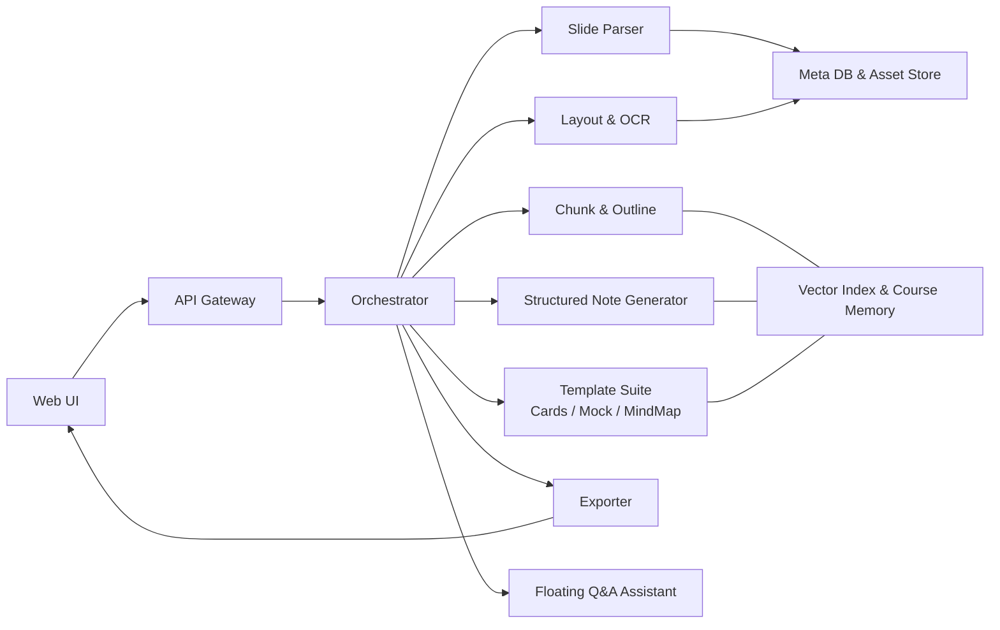
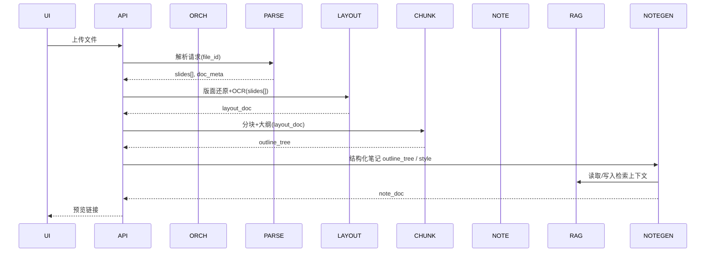
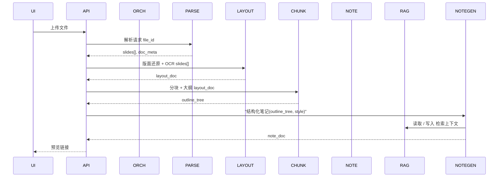

# 系统架构设计文档（Architecture Design Spec）

> 目标：为工程团队与代码生成工具（如 Codex）提供足够明确、可执行的系统蓝图，用以实现“从课件到多形态学习资料的自动化生成”。项目宗旨与范围以团队提案为准：将课程幻灯片转化为**组织良好、分层且可控风格**的学习材料，并支持模板化输出与风格调节。

------

## 1. 业务背景与范围（简）

- 背景：学生面对**复杂课件+碎片化资料**，需要“结构化、可复用”的学习资料生成。
- 范围：提供**结构化笔记**（二维风格控制）、**知识卡片**、**模拟试题**、**思维导图/知识树**四类核心产物；并支持**页面式内容还原**与**悬浮式问答助手**。产物形态与风格控制符合提案中的**模板化输出**与**两参数风格控制**。

------

## 2. 总体架构概览

### 2.1 架构风格

- **模块化单体（Modular Monolith）**起步：单一部署单元中按域划分清晰模块与进程边界，保留未来服务解耦的演进路径。
- 前端以**Web UI**为统一入口；中台以**编排器（Orchestrator）**组织“解析→重建→分块→生成→导出”的主流程；底座是**课程记忆库（RAG）**与持久化存储。对应提案“前端/Web界面”“Agent服务层”“数据库/RAG”。

### 2.2 组件图（逻辑）



### 2.3 关键流程

1. **Upload & Parse**（上传与解析）
2. **Recognize & Organize**（OCR识别、结构整理）
3. **Chunk & Outline**（分块与大纲）
4. **Generate & Refine**（生成与校整：outline→expand→integrate）
5. **Embed & Export**（插图/公式回填与导出）。

------

## 3. 模块分解（Domain Decomposition）

> 每个模块给出：**职责**、**输入/输出契约**、**核心规则**、**失败与补救**。若无特殊说明，默认同步API+异步编排双模式均可实现。

### 3.1 Slide Parser（课件解析）

- **职责**：接收PPT/PDF，抽取页级结构（标题、文本块、图片、公式占位）、基础语义标签与阅读顺序，生成**分层映射（hierarchical map）**。
- **输入**：`file_id`，文件二进制或对象存储URL。
- **输出（JSON）**：`slides[]`（每页含 `blocks[]`：`type`{title/text/image/formula/table}、`bbox`、`order`、`raw_text`…）、`doc_meta`。
- **规则**：保持**页序+层级**信息；为OCR与布局重构提供骨架。
- **失败补救**：页级容错；单页失败不影响全局，记录告警并回退到纯文本抽取。

### 3.2 Layout & OCR（页面还原与识别）

- **职责**：根据解析的结构对图片/表格/公式做OCR，输出**版面保真**的可重建元素；生成**图片/公式说明（caption）**用于后续讲解。提案要求“保持布局、重插视觉元素、含公式说明”。
- **输入**：`slides[]` + 资源句柄。
- **输出**：`layout_doc`（页→区块→元素，含 `image_uri`、`latex`、`caption`）。
- **规则**：优先“所见即所得”；图片以截图URI引用；公式统一Latex表示。
- **失败补救**：当OCR失败→以占位图+“识别失败”提示+允许二次重试。

### 3.3 Chunk & Outline（分块与大纲）

- **职责**：生成**章节化大纲**与**分层分块**（避免语义断裂）；为生成器提供带**锚点**的上下文。提案主张：层级式分块、页级锚点摘要、按节深度动态组装、分阶段提示（先结构后细节）。
- **输入**：`layout_doc`。
- **输出**：`outline_tree`（带 `section_id`、`anchor`、`summary`）。
- **规则**：**章节优先**，粒度受控（章节→小节→要点）；每节点产出短摘要与关键术语。
- **失败补救**：若结构不清晰→降级为“页→块”二层结构。

### 3.4 Structured Note Generator（结构化笔记生成器）

- **职责**：根据**两维风格参数**（详略：Brief/Medium/Detailed；难度：Simple/Explanatory/Academic）生成**9种组合风格**的结构化笔记。
- **输入**：`outline_tree`、`style.detail_level`、`style.difficulty`。
- **输出**：`note_doc`（带章节、要点、例子、术语表、引用的图片/公式/表格）。
- **规则**：层级清晰、语义连贯；不同档位在长度、术语密度、示例数量上可辨。
- **失败补救**：若生成不达标→触发“局部回写”（只重生失真节点），整体保留。

### 3.5 Template Suite（模板套件）

> 明确四类可交付物与产出规范（与提案“模板化输出”一致：详细/摘要、导图、题库、知识卡）。

- **A. 知识卡片（Cards）**
  - 输入：`note_doc`；输出：`cards[]`（概念、定义、考点、典题+解）。
  - 规范：每卡 80–180 词；附“易混点”1–2条（可选）。
- **B. 模拟试题（Mock Exam）**
  - 输入：`note_doc`；输出：题目集合（选择/填空/简答）+ 标准答案 + 关键点。
  - 规范：支持“按章节/整卷”两种组织方式；题量、难度可配。
- **C. 思维导图/知识树（Mind Map/Tree）**
  - 输入：`outline_tree`；输出：节点-边结构（可导出静态图或交互文件）。
  - 规范：节点可折叠；节点跳转到笔记对应锚点。
- **D. 结构化笔记（Notes）**
  - 即 3.4 产物；允许风格切换快速重生，不改变章节骨架。

### 3.6 Exporter（导出器）

- **职责**：将各产物导出为 Markdown / PDF / Image（导图）等。提案指出“多格式查看与导出”。
- **输入**：`note_doc` / `cards[]` / `mock_paper` / `mindmap_graph`。
- **输出**：文件句柄与下载链接。
- **规则**：保持统一排版规范、目录/锚点一致；图片/公式可视化正确。

### 3.7 Floating Q&A Assistant（悬浮式问答）

- **职责**：对当前课程产物进行内联问答与出题训练；以悬浮球唤起，不打断主流程（PRD约定）。
- **输入**：用户问题 + 产物上下文（只限当前课程会话）。
- **输出**：解释/例题/跳转至相关章节链接。
- **规则**：会话隔离，严格限定在当前课程材料范围内。

### 3.8 RAG & Storage（课程记忆与存储）

- **职责**：为“分块检索+生成校整”提供高质量上下文；存储课程元数据与图片/表格/公式截图。提案指向“FAISS + SQLite/PostgreSQL + 本地资源存储”。
- **输入/输出**：向各上层模块提供向量检索、元数据读取与资源URI。
- **规则**：以**课程会话**为作用域，索引粒度与分块策略与 3.3 对齐。

------

## 4. 接口规范（API Contract）

> 采用 REST+JSON（亦可并行提供内网Python SDK）。示例仅展示关键字段，返回值一律包含 `request_id` 与 `status`。

### 4.1 上传与解析

- `POST /api/v1/files`：上传课件 → `{ file_id }`
- `POST /api/v1/parse`：`{ file_id }` → `{ doc_meta, slides[] }`

### 4.2 版面还原与OCR

- `POST /api/v1/layout/build`：`{ file_id }` → `{ layout_doc }`

### 4.3 分块与大纲

- `POST /api/v1/outline/build`：`{ layout_doc }` → `{ outline_tree }`

### 4.4 结构化笔记

- `POST /api/v1/notes/generate`
   Request：

  ```json
  {
    "outline_tree_id": "uuid",
    "style": { "detail_level": "brief|medium|detailed", "difficulty": "simple|explanatory|academic" }
  }
  ```

  Response：`{ note_doc_id, preview_url }`

### 4.5 模板产物

- `POST /api/v1/cards/generate`：`{ note_doc_id }` → `{ cards_id }`
- `POST /api/v1/mock/generate`：`{ note_doc_id, mode: "chapter|full", size: 20, difficulty: "low|mid|high" }` → `{ paper_id }`
- `POST /api/v1/mindmap/generate`：`{ outline_tree_id }` → `{ graph_id }`

### 4.6 导出

- `POST /api/v1/export`：`{ target_id, type: "notes|cards|mock|mindmap", format: "md|pdf|png" }` → `{ download_url }`

### 4.7 问答

- `POST /api/v1/qa/ask`：`{ session_id, question, scope: "notes|cards|mock" }` → `{ answer, refs[] }`

------

## 5. 数据模型（核心表 & 索引）

> 关系库（SQLite/PG）+ 向量索引（FAISS）。与提案一致：**元数据**入库，**语义索引**入向量库，**图片/表格/公式**保存在资产存储中。

**关系模型（简要）：**

- `course_session(id, title, created_at, user_id, file_id, status)`
- `slide(id, course_session_id, page_no, meta_json)`
- `block(id, slide_id, type, bbox, order, raw_text, asset_uri, latex)`
- `outline_node(id, course_session_id, parent_id, title, summary, anchor, level, order)`
- `note_doc(id, course_session_id, style_detail, style_difficulty, content_md, toc_json)`
- `cards(id, course_session_id, json)`
- `mock_paper(id, course_session_id, json)`
- `mindmap_graph(id, course_session_id, json)`

**向量索引（按作用域）：**

- `idx_course_session`（分块文本；key=`course_session_id`；payload=`outline_node_id|block_id`）

------

## 6. 关键序列（时序）

### 6.1 生成结构化笔记



### 6.2 生成模拟试题



------

## 7. 配置与环境

- **配置文件**：`config.yaml`（存储引擎、导出选项、默认风格、大小限制、日志级别）。
- **环境变量**：`STORAGE_ROOT`, `DB_URL`, `VECTOR_DB_PATH`, `MAX_FILE_SIZE_MB`, `DEFAULT_STYLE_*`。
- **静态资源**：`/assets/{session_id}/images/*`、`/assets/{session_id}/tables/*`。

------

## 8. 可靠性与可观测性

- **幂等与断点续跑**：以 `course_session_id` 为粒度，所有阶段写入进度；失败可从最近成功阶段恢复。
- **日志**：请求链路ID、阶段耗时、错误栈；产物摘要（字数、节点数）。
- **指标**：解析成功率、单页OCR失败率、单课程生成时长P50/P95、导出失败率。
- **审计**：用户下载与导出操作留痕，便于复现。

------

## 9. 安全与合规

- **输入安全**：文件类型白名单（`.pptx|.pdf`）、大小限制、页数上限、超时控制。
- **数据隔离**：会话级命名空间；公开分享需显式同意。
- **内容标注**：产物元信息写入来源与时间，利于学术诚信与追溯。

------

## 12. 代码结构建议（仓库）

```
/app
  /api              # REST 入口与契约
  /orchestrator     # 编排与阶段控制
  /modules
    /parser         # 3.1
    /layout_ocr     # 3.2
    /chunk_outline  # 3.3
    /note           # 3.4
    /templates      # 3.5 (cards/mock/mindmap)
    /exporter       # 3.6
    /qa             # 3.7
  /storage          # 3.8 适配层（DB/向量/资产）
  /schemas          # Pydantic/JSON Schema
  /configs
  /tests
/docs               # 本设计文档 & API 文档
```

------

## 13. 风险与缓解

- **版面复杂度高**：先保证“标题-正文-图片-公式”四大类的稳定识别，表格可退化为图片+caption。
- **长文档耗时**：页级并行；大纲/模板生成分阶段返回（先骨架后细化）。
- **语义断裂**：坚持“章节优先”的层级分块与锚点摘要；先搭结构再填内容，与提案一致。

