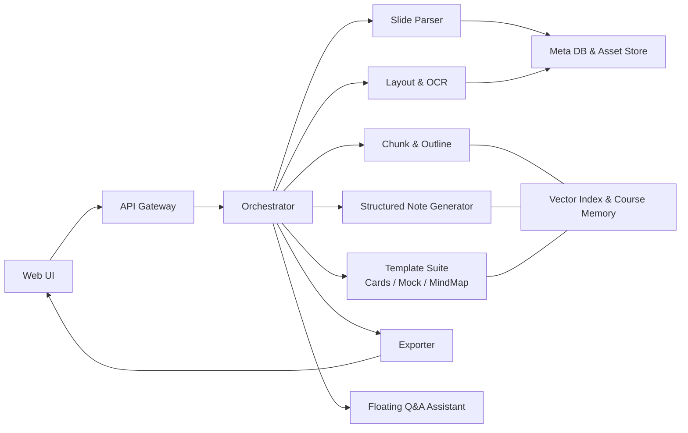

# **StudyCompanion** **智能笔记生****成系统项目**
## **摘要**
本报告介绍了一款基于大语言模型（LLM）的智能学习系统 —— StudyCompanion。该系统以课堂 PPT / PDF 作为输入，自动完成内容解析、大纲抽取、结构化笔记生成、学习卡片、模拟试题与思维导图等多种辅助学习资料的生成，实现课堂材料向可控风格学习资源的自动转换。系统整体采用 FastAPI + 前端 UI 的架构，通过解析模块、笔记生成模块、模板生成模块与 RAG 问答模块构成完整的学习闭环，实现高质量、多格式的知识输出。

## **引言**
在现代课程学习中，学生常常需要处理大量 PPT、PDF 等学习材料，但这些材料分散、冗长、结构不统一，无法直接用于复习整理。借助大语言模型的文本生成与理解能力，可以将原始课件转化为结构化、可控风格的学习内容。

StudyCompanion 的设计目标包括：

自动化解析课件内容；

构建统一、层级化的大纲结构；

生成多种风格的学习笔记；

输出学习卡片、模拟试题、思维导图；

支持 RAG 策略下的基于课件内容问答；

提供统一的平台提升用户体验。

## **系统总体设计**
StudyCompanion 利用RAG处理上传的课件，通过调用LLM并利用构建的agent实现笔记生成，采用前后端分离架构，由前端（React）、后端（FastAPI）、存储层（SQLite、FAISS、文件系统）构成完整的学习资料生成系统。

### 系统架构
**前端（React）**：提供交互界面，包括文件上传、笔记展示、导图查看等；

**后端（FastAPI)**: 调用LLM并利用Agent实现文件上传、解析、大纲抽取、笔记生成、模板生成、问答模块等功能；

**数据存储（SQLite + FAISS）**：用于保存向量索引、会话数据、解析内容与导出的文件。

系统支持 Google Gemini 或 OpenAI API 作为推理模型，并支持多格式导出。

```plain
前端界面 (React + TypeScript)
    ↓
API网关 (FastAPI)
    ↓
编排器 (CourseSessionPipeline)
    ↓
功能模块 (解析器、布局还原、大纲构建、笔记生成等)
    ↓
数据存储 (SQLite + FAISS + 文件系统)
```

### <font style="color:rgb(51, 51, 51);">系统架构图</font>


## **核心功能模块**
#### **1. 结构化笔记生成系统**
**功能描述**：系统的核心功能，通过两条滑档控制生成9种不同风格的笔记：

+ **详略程度**：简略（brief）、中等（medium）、详细（detailed）
+ **表达层级**：通俗易懂（popular）、标准讲解（standard）、学术深入（insightful）
+ **技术特点**：
    - 保持章节结构不变，仅调整内容密度和表达方式
    - 支持中英文双语输出
    - 自动保留图片、公式等视觉元素并生成说明文字

#### 2. 知识卡片生成
**功能描述**：为期末复习与快速回顾设计，按章节自动生成核心概念卡片：

+ 包含概念定义、考点分析、典型例题
+ 支持翻面查看答案和解析
+ 可导出为PDF格式便于打印复习

#### 3. 模拟试题生成
**功能描述**：从课件内容中自动生成复习题目：

+ 题型包括选择题、填空题、简答题
+ 支持章节测验和整卷模拟两种模式
+ 每题附带标准答案与关键点解析

#### 4. 思维导图与知识树
**功能描述**：以图形化方式展示章节、概念与知识之间的逻辑关系：

+ 自动根据大纲生成层级结构
+ 支持节点展开/折叠操作
+ 可导出为PNG图片格式

#### 5. 页面式内容还原
**功能描述**：保留课件的视觉结构，提升学习沉浸感：

+ 保持文字、图片、公式等原有布局
+ 自动补充说明文字和公式解释
+ 支持图片和公式的精确引用

#### 6. 浮动式问答助手
**功能描述**：在主界面右侧以悬浮球形式存在，提供即时问答功能：

+ 基于RAG技术进行上下文检索
+ 提供答案溯源引用
+ 支持小测验模式

#### 7. 支持导出三种格式：
+ **Markdown**（可编辑）
+ **PDF**（带目录和页眉）
+ **PNG**（思维导图）

便于在不同平台或学习场景使用。


## **技术模块实现**
#### 1. 课件解析模块 (Slide Parser)
**职责**：解析PPT/PDF文件，抽取页级结构信息

+ **输入**：`file_id`，文件二进制或对象存储URL
+ **输出**：`slides[]`（每页含 `blocks[]`：`type`{title/text/image/formula/table}、`bbox`、`order`、`raw_text`…）、`doc_meta`
+ **技术实现**：
    - 使用 `python-pptx` 库解析PPTX文件
    - 使用 `PyMuPDF` 库解析PDF文件
    - 保持页序+层级信息，为OCR与布局重构提供骨架
+ **失败补救**：页级容错；单页失败不影响全局，记录告警并回退到纯文本抽取

#### 2. 页面还原模块 (Layout & OCR)
**职责**：保持页面布局，生成视觉元素说明

+ **输入**：`slides[]`（来自解析）
+ **输出**：`layout_doc`（页→区块→元素，含 `image_uri`、`latex`、`caption`）
+ **技术实现**：
    - 对图片/表格/公式进行OCR识别
    - 生成图片/公式说明文字（caption）
    - 保持"所见即所得"的视觉效果
+ **失败补救**：当OCR失败→以占位图+"识别失败"提示+允许二次重试

#### 3. 大纲构建模块 (Chunk & Outline)
**职责**：生成章节优先的知识树结构

+ **输入**：`layout_doc`
+ **输出**：`outline_tree`（带 `section_id`、`anchor`、`summary`）
+ **技术实现**：
    - 采用"章节优先"的层级分块策略
    - 深度 `root → chapter → topic → bullet`（最多4层）
    - 每个节点生成锚点摘要（30-60词）
    - 记录溯源信息（页号 + 区块引用）
+ **失败补救**：若结构不清晰→降级为"页→块"二层结构

#### 4. 笔记生成模块 (Structured Note Generator)
**职责**：根据风格参数生成9种组合的笔记

+ **输入**：`outline_tree`、`style.detail_level`、`style.difficulty`
+ **输出**：`note_doc`（带章节、要点、例子、术语表、引用的图片/公式/表格）
+ **技术实现**：
    - 基于新Prompt架构方案的三阶段生成
    - 实现详略程度和表达层级的精确控制
    - 支持中英文双语输出
    - 保持章节骨架不变，仅调整内容密度
+ **失败补救**：若生成不达标→触发"局部回写"（只重生失真节点），整体保留

#### 5. 模板套件模块 (Template Suite)
**职责**：生成知识卡片、模拟试题、思维导图

+ **知识卡片 (Cards)**：
    - 输入：`note_doc`
    - 输出：`cards[]`（概念、定义、考点、典题+解）
    - 规范：每卡80-180词；附"易混点"1-2条
+ **模拟试题 (Mock Exam)**：
    - 输入：`note_doc`；选项 `{ mode:"chapter|full", size:int, difficulty:"low|mid|high" }`
    - 输出：题目集合（选择/填空/简答）+ 标准答案 + 关键点
    - 规范：`mcq:fill:short` 比例默认 `5:3:2`
+ **思维导图/知识树 (Mind Map/Tree)**：
    - 输入：`outline_tree`
    - 输出：节点-边结构（可导出静态图或交互文件）
    - 规范：节点可折叠；节点跳转到笔记对应锚点

#### 6. 导出模块 (Exporter)
**职责**：将各产物导出为 Markdown / PDF / Image（导图）等

+ **输入**：`note_doc | cards | paper | graph`，`format: "md|pdf|png"`
+ **输出**：文件句柄与下载链接
+ **技术实现**：
    - Markdown：保留标题层级（`#..####`）、图片 ``、公式 `$...$`/`$$...$$`
    - PDF：自动生成目录与页眉；锚点与页码对齐
    - PNG：限导图 `graph`

#### 7. 浮动问答模块 (Floating Q&A Assistant)
**职责**：对当前课程产物进行内联问答与出题训练

+ **输入**：用户问题 + 产物上下文（只限当前课程会话）
+ **输出**：解释/例题/跳转至相关章节链接
+ **技术实现**：基于RAG检索增强生成技术

#### 8. 编排器模块 (Orchestrator)
**职责**：协调各模块执行顺序，管理会话状态

+ **状态机**：`UPLOADED → PARSED → LAYOUT_BUILT → OUTLINE_READY → NOTES_READY → TEMPLATES_READY → EXPORTED`
+ **失败转移**：任一阶段 `*_FAILED` → 支持"从最近成功阶段重跑"

#### 9. RAG与存储模块 (RAG & Storage)
**职责**：为"分块检索+生成校整"提供高质量上下文

+ **向量索引**：FAISS向量数据库，按会话隔离
+ **关系数据库**：SQLite存储元数据和产物索引
+ **文件存储**：本地文件系统存储上传文件、解析产物、导出结果


## **用户界面设计**
系统采用现代化的Web界面设计：

#### 1. Dashboard
+ 最近会话列表
+ 新建会话按钮
+ 会话状态指示


#### 2. Workspace
**三栏布局**：

**左侧**：章节树导航 (TOC)

**中间**：内容画布

**右侧**：风格控制面板


#### 3. 风格控制面板
+ 详略程度滑档
+ 表达层级滑档
+ 模板选择器
+ 生成/导出操作
+ 历史版本管理

## **使用流程**
1. 上传课程 PPT/PDF；
2. 系统自动解析文本内容；
3. 完成布局还原与页面结构提取；
4. 自动构建章节大纲；
5. 选择笔记风格生成完整学习笔记；
6. 根据需要生成卡片、试题、思维导图；
7. 导出为 PDF/Markdown/PNG；
8. 使用 RAG 问答深入学习知识点。

整个过程在 Web UI 中即可完成，无需额外工具。


## **总结**
StudyCompanion 通过自动化课件解析、结构化内容生成与多模板学习资源生成，为学生与教师提供了一套完整的智能学习支持系统。系统具有较高的可用性与可扩展性，能够有效提升学习效率、降低笔记整理成本，并实现基于课件内容的问答与复习工具整合。

未来可进一步优化图表解析、多语言支持、学习路线推荐等功能，进一步增强其在教育领域的实用价值。

